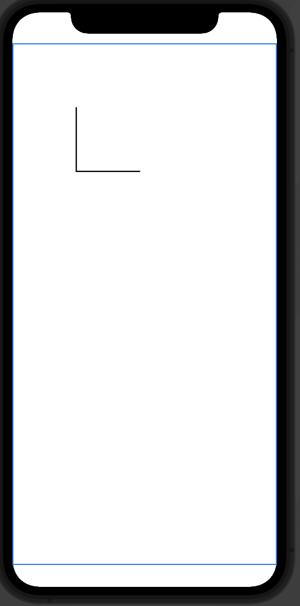

#  SwiftUI Paths
Shows how to use the SwiftUI paths from the excellent CodeWithChris.com tutorial here: https://learn.codewithchris.com/courses/take/design/lessons/25824104-lesson-3-swiftui-paths

Create a path with a stroke:
```
// Create path with closure to draw the initial elements
Path { path in
    // Series of commands to draw the path/ shape
    
    // Like picking up pen, then dropping it 100 from the top-left down and right 100
    path.move(to: CGPoint(x: 100, y: 100))
    
    // Now draw a line 100 down from the current point
    path.addLine(to: CGPoint(x: 100, y: 200))
}
.strokedPath(StrokeStyle(lineWidth: 2))
```


Now draw a line 100 from the current point to the right by keeping the same Y axis:
```
Path { path in
    // Series of commands to draw the path/ shape
    
    // Like picking up pen, then dropping it 100 from the top-left down and right 100
    path.move(to: CGPoint(x: 100, y: 100))
    
    // Now draw a line ending at the 200 on the Y axis
    path.addLine(to: CGPoint(x: 100, y: 200))
    
    // Now draw a line to the right by 200, but keep the Y the same
    path.addLine(to: CGPoint(x: 200, y: 200))
}
.strokedPath(StrokeStyle(lineWidth: 2))
```


Square drawn with four different paths:
```
// Create path with closure to draw the initial elements
Path { path in
    // Series of commands to draw the path/ shape
    
    // Like picking up pen, then dropping it 100 from the top-left down and right 100
    path.move(to: CGPoint(x: 100, y: 100))
    
    // Now draw a line ending at the 200 on the Y axis
    path.addLine(to: CGPoint(x: 100, y: 200))
    
    // Now draw a line to the right by 200, but keep the Y the same
    path.addLine(to: CGPoint(x: 200, y: 200))
    
    // Now draw the line 100 up
    path.addLine(to: CGPoint(x: 200, y: 100))
    
    // Now draw the final point, by moving it 100 to the left
    path.addLine(to: CGPoint(x: 100, y: 100))
    
}
.strokedPath(StrokeStyle(lineWidth: 2))
```


Now that the path has been connected, you can fill it (note you need to remove the stroke):
```
// Create path with closure to draw the initial elements
Path { path in
    // Series of commands to draw the path/ shape
    
    // Like picking up pen, then dropping it 100 from the top-left down and right 100
    path.move(to: CGPoint(x: 100, y: 100))
    
    // Now draw a line ending at the 200 on the Y axis
    path.addLine(to: CGPoint(x: 100, y: 200))
    
    // Now draw a line to the right by 200, but keep the Y the same
    path.addLine(to: CGPoint(x: 200, y: 200))
    
    // Now draw the line 100 up
    path.addLine(to: CGPoint(x: 200, y: 100))
    
    // Now draw the final point, by moving it 100 to the left
    path.addLine(to: CGPoint(x: 100, y: 100))
    
}
.foregroundColor(.blue)
```


Note that using the `.fill(.blue)` modifier achieves the same effect, but also allows the use of a gradient.

Instead, of using four individual addLines, you can instead use the `.addLines`, then pass in a list
of `CGPoint`s:
```
// Then move this shape
path.move(to: CGPoint(x: 100, y: 300))

// Now add an array of lines
path.addLines([
    CGPoint(x: 100, y: 400), // Move down by 100
    CGPoint(x: 200, y: 400), // Move right by 100, same y-axis
    CGPoint(x: 200, y: 300), // Move up by 100, same X-axis
    CGPoint(x: 100, y: 300) // Move left by 100, same y-axis
])
```


Now you can act upon the shapes as if they were one object. For example, you can rotate the shapes by 
a specified angle. Note that it rotates from the center of the blue frame shown in the Preview:


Add a `.scaleEffect(0.5)` modifier to scale the shapes down to half the current size:


# Assigning Shapes as Properties
You can even assign a shape as a property, which can be re-used:
```
// Declare a custom Path property
var customPath: Path = {
    
    // Move the path information from below into here
    return Path {...path in }
  
}()

// Then call the customPath later
customPath
.foregroundColor(.blue)
.rotationEffect(Angle(degrees: 30))
.scaleEffect(0.5)
```

You can use a frame modifier to change the point, where the shape rotates as well. 

# Clip Shape with Custom Path
Re-using the `customPath`, you can even clip the shape of the beach image to match this
shape:
```
// Create an image with the custom path
Image("beach")
    .resizable()
    .clipShape(customPath)
```


